### Course [<>](https://github.com/byuitechops/canvas-api-wrapper/blob/api/api.js#L78 "Source")
  
*course*.**getType()** ➜ `"Course"` 
  
*course*.**getId()** ➜ *course*.**id** 
  
*course*.**getParentIds()** ➜ `[]` 
  
*course*.**[get/set]Title()** ➜ *course*.**name** 
  
*course*.**getPath()** ➜ `"/api/v1/courses/:id"` 
  
*course*.**getPath(false)** ➜ `"/api/v1/courses"` 
  
*course*.**getUrl()** ➜ `"https://<subdomain>.instructure.com/courses/:id"` 
  

### Assignment [<>](https://github.com/byuitechops/canvas-api-wrapper/blob/api/api.js#L112 "Source")
  
*assignment*.**getType()** ➜ `"Assignment"` 
  
*assignment*.**getId()** ➜ *assignment*.**id** 
  
*assignment*.**getParentIds()** ➜ `[:course]` 
  
*assignment*.**[get/set]Title()** ➜ *assignment*.**name** 
  
*assignment*.**[get/set]Html()** ➜ *assignment*.**description** 
  
*assignment*.**getPath()** ➜ `"/api/v1/courses/:course/assignments/:id"` 
  
*assignment*.**getPath(false)** ➜ `"/api/v1/courses/:course/assignments"` 
  
*assignment*.**getUrl()** ➜ *assignment*.**html_url** 
  

### Override [<>](https://github.com/byuitechops/canvas-api-wrapper/blob/api/api.js#L126 "Source")
  
*override*.**getType()** ➜ `"Override"` 
  
*override*.**getId()** ➜ *override*.**id** 
  
*override*.**getParentIds()** ➜ `[:course,:assignment]` 
  
*override*.**[get/set]Title()** ➜ *override*.**title** 
  
*override*.**getPath()** ➜ `"/api/v1/courses/:course/assignments/:assignment/overrides/:id"` 
  
*override*.**getPath(false)** ➜ `"/api/v1/courses/:course/assignments/:assignment/overrides"` 
  

### Submission [<>](https://github.com/byuitechops/canvas-api-wrapper/blob/api/api.js#L0 "Source")
  
*submission*.**getType()** ➜ `"Submission"` 
  
*submission*.**getId()** ➜ *submission*.**user_id** 
  
*submission*.**getParentIds()** ➜ `[:course,:assignment]` 
  
*submission*.**[get/set]Html()** ➜ *submission*.**body** 
  
*submission*.**getPath()** ➜ `"/api/v1/courses/:course/assignments/:assignment/submissions/:id"` 
  
*submission*.**getPath(false)** ➜ `"/api/v1/courses/:course/assignments/:assignment/submissions"` 
  
*submission*.**getUrl()** ➜ *submission*.**preview_url** 
  

### Discussion [<>](https://github.com/byuitechops/canvas-api-wrapper/blob/api/api.js#L143 "Source")
  
*discussion*.**getType()** ➜ `"Discussion"` 
  
*discussion*.**getId()** ➜ *discussion*.**id** 
  
*discussion*.**getParentIds()** ➜ `[:course]` 
  
*discussion*.**[get/set]Title()** ➜ *discussion*.**title** 
  
*discussion*.**[get/set]Html()** ➜ *discussion*.**message** 
  
*discussion*.**getPath()** ➜ `"/api/v1/courses/:course/discussion_topics/:id"` 
  
*discussion*.**getPath(false)** ➜ `"/api/v1/courses/:course/discussion_topics"` 
  
*discussion*.**getUrl()** ➜ *discussion*.**html_url** 
  

### Entry [<>](https://github.com/byuitechops/canvas-api-wrapper/blob/api/api.js#L153 "Source")
  
*entry*.**getType()** ➜ `"Entry"` 
  
*entry*.**getId()** ➜ *entry*.**id** 
  
*entry*.**getParentIds()** ➜ `[:course,:discussion]` 
  
*entry*.**[get/set]Html()** ➜ *entry*.**message** 
  
*entry*.**getPath()** ➜ `"/api/v1/courses/:course/discussion_topics/:discussion/entries/:id"` 
  
*entry*.**getPath(false)** ➜ `"/api/v1/courses/:course/discussion_topics/:discussion/entries"` 
  

### Reply [<>](https://github.com/byuitechops/canvas-api-wrapper/blob/api/api.js#L172 "Source")
  
*reply*.**getType()** ➜ `"Reply"` 
  
*reply*.**getId()** ➜ *reply*.**id** 
  
*reply*.**getParentIds()** ➜ `[:course,:discussion,:entry]` 
  
*reply*.**[get/set]Html()** ➜ *reply*.**message** 
  
*reply*.**getPath()** ➜ `"/api/v1/courses/:course/discussion_topics/:discussion/entries/:entry/replies/:id"` 
  
*reply*.**getPath(false)** ➜ `"/api/v1/courses/:course/discussion_topics/:discussion/entries/:entry/replies"` 
  

### File [<>](https://github.com/byuitechops/canvas-api-wrapper/blob/api/api.js#L184 "Source")
  
*file*.**getType()** ➜ `"File"` 
  
*file*.**getId()** ➜ *file*.**id** 
  
*file*.**getParentIds()** ➜ `[:course]` 
  
*file*.**[get/set]Title()** ➜ *file*.**display_name** 
  
*file*.**getPath()** ➜ `"/api/v1/files/:id"` 
  
*file*.**getPath(false)** ➜ `"/api/v1/courses/:course/files"` 
  
*file*.**getUrl()** ➜ `"https://<subdomain>.instructure.com/courses/:course/files/?preview=:id"` 
  

### Folder [<>](https://github.com/byuitechops/canvas-api-wrapper/blob/api/api.js#L198 "Source")
  
*folder*.**getType()** ➜ `"Folder"` 
  
*folder*.**getId()** ➜ *folder*.**id** 
  
*folder*.**getParentIds()** ➜ `[:course]` 
  
*folder*.**[get/set]Title()** ➜ *folder*.**name** 
  
*folder*.**getPath()** ➜ `"/api/v1/folders/:id"` 
  
*folder*.**getPath(false)** ➜ `"/api/v1/courses/:course/folders"` 
  
*folder*.**getUrl()** ➜ *folder*.**folders_url** 
  

### Module [<>](https://github.com/byuitechops/canvas-api-wrapper/blob/api/api.js#L203 "Source")
  
*module*.**getType()** ➜ `"Module"` 
  
*module*.**getId()** ➜ *module*.**id** 
  
*module*.**getParentIds()** ➜ `[:course]` 
  
*module*.**[get/set]Title()** ➜ *module*.**name** 
  
*module*.**getPath()** ➜ `"/api/v1/courses/:course/modules/:id"` 
  
*module*.**getPath(false)** ➜ `"/api/v1/courses/:course/modules"` 
  
*module*.**getUrl()** ➜ `"https://<subdomain>.instructure.com/courses/:course/modules#context_module_:id"` 
  

### ModuleItem [<>](https://github.com/byuitechops/canvas-api-wrapper/blob/api/api.js#L0 "Source")
  
*moduleitem*.**getType()** ➜ `"ModuleItem"` 
  
*moduleitem*.**getId()** ➜ *moduleitem*.**id** 
  
*moduleitem*.**getParentIds()** ➜ `[:course,:module]` 
  
*moduleitem*.**[get/set]Title()** ➜ *moduleitem*.**title** 
  
*moduleitem*.**getPath()** ➜ `"/api/v1/courses/:course/modules/:module/items/:id"` 
  
*moduleitem*.**getPath(false)** ➜ `"/api/v1/courses/:course/modules/:module/items"` 
  
*moduleitem*.**getUrl()** ➜ *moduleitem*.**html_url** 
  

### Page [<>](https://github.com/byuitechops/canvas-api-wrapper/blob/api/api.js#L219 "Source")
  
*page*.**getType()** ➜ `"Page"` 
  
*page*.**getId()** ➜ *page*.**page_id** 
  
*page*.**getParentIds()** ➜ `[:course]` 
  
*page*.**[get/set]Title()** ➜ *page*.**title** 
  
*page*.**[get/set]Html()** ➜ *page*.**body** 
  
*page*.**getPath()** ➜ `"/api/v1/courses/:course/pages/:id"` 
  
*page*.**getPath(false)** ➜ `"/api/v1/courses/:course/pages"` 
  
*page*.**getUrl()** ➜ *page*.**html_url** 
  

### Quiz [<>](https://github.com/byuitechops/canvas-api-wrapper/blob/api/api.js#L232 "Source")
  
*quiz*.**getType()** ➜ `"Quiz"` 
  
*quiz*.**getId()** ➜ *quiz*.**id** 
  
*quiz*.**getParentIds()** ➜ `[:course]` 
  
*quiz*.**[get/set]Title()** ➜ *quiz*.**title** 
  
*quiz*.**[get/set]Html()** ➜ *quiz*.**description** 
  
*quiz*.**getPath()** ➜ `"/api/v1/courses/:course/quizzes/:id"` 
  
*quiz*.**getPath(false)** ➜ `"/api/v1/courses/:course/quizzes"` 
  
*quiz*.**getUrl()** ➜ *quiz*.**html_url** 
  

### Question [<>](https://github.com/byuitechops/canvas-api-wrapper/blob/api/api.js#L243 "Source")
  
*question*.**getType()** ➜ `"Question"` 
  
*question*.**getId()** ➜ *question*.**id** 
  
*question*.**getParentIds()** ➜ `[:course,:quiz]` 
  
*question*.**[get/set]Title()** ➜ *question*.**question_name** 
  
*question*.**[get/set]Html()** ➜ *question*.**question_text** 
  
*question*.**getPath()** ➜ `"/api/v1/courses/:course/quizzes/:quiz/questions/:id"` 
  
*question*.**getPath(false)** ➜ `"/api/v1/courses/:course/quizzes/:quiz/questions"` 
  
*question*.**getUrl()** ➜ `"https://<subdomain>.instructure.com/courses/:course/quizzes/:quiz/edit#question_:id"` 
  

### GroupCategory [<>](https://github.com/byuitechops/canvas-api-wrapper/blob/api/api.js#L0 "Source")
  
*groupcategory*.**getType()** ➜ `"GroupCategory"` 
  
*groupcategory*.**getId()** ➜ *groupcategory*.**id** 
  
*groupcategory*.**getParentIds()** ➜ `[:course]` 
  
*groupcategory*.**[get/set]Title()** ➜ *groupcategory*.**name** 
  
*groupcategory*.**getPath()** ➜ `"/api/v1/group_categories/:id"` 
  
*groupcategory*.**getPath(false)** ➜ `"/api/v1/courses/:course/group_categories"` 
  
*groupcategory*.**getUrl()** ➜ `"https://<subdomain>.instructure.com/courses/:course/groups#tab-:id"` 
  

### Group [<>](https://github.com/byuitechops/canvas-api-wrapper/blob/api/api.js#L274 "Source")
  
*group*.**getType()** ➜ `"Group"` 
  
*group*.**getId()** ➜ *group*.**id** 
  
*group*.**getParentIds()** ➜ `[:course,:groupcategory]` 
  
*group*.**[get/set]Title()** ➜ *group*.**name** 
  
*group*.**[get/set]Html()** ➜ *group*.**description** 
  
*group*.**getPath()** ➜ `"/api/v1/groups/:id"` 
  
*group*.**getPath(false)** ➜ `"/api/v1/group_categories/:groupcategory/groups"` 
  
*group*.**getUrl()** ➜ `"https://<subdomain>.instructure.com/groups/:groupcategory"` 
  

### Membership [<>](https://github.com/byuitechops/canvas-api-wrapper/blob/api/api.js#L292 "Source")
  
*membership*.**getType()** ➜ `"Membership"` 
  
*membership*.**getId()** ➜ *membership*.**id** 
  
*membership*.**getParentIds()** ➜ `[:course,:groupcategory,:group]` 
  
*membership*.**getPath()** ➜ `"/api/v1/groups/:group/memberships/:id"` 
  
*membership*.**getPath(false)** ➜ `"/api/v1/groups/:group/memberships"` 
  
